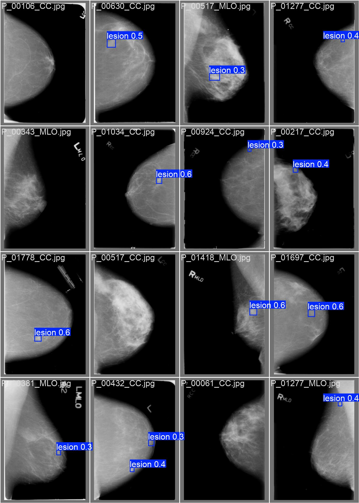
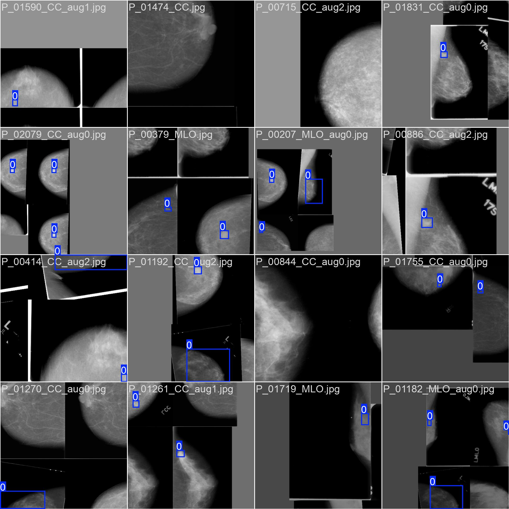
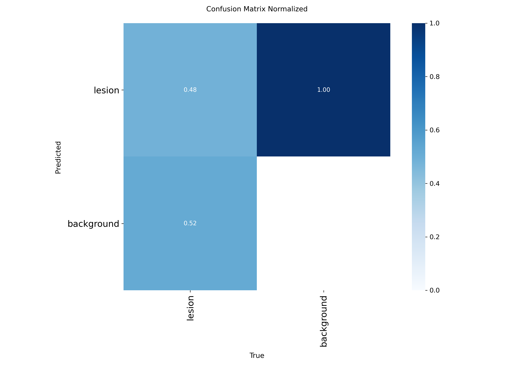
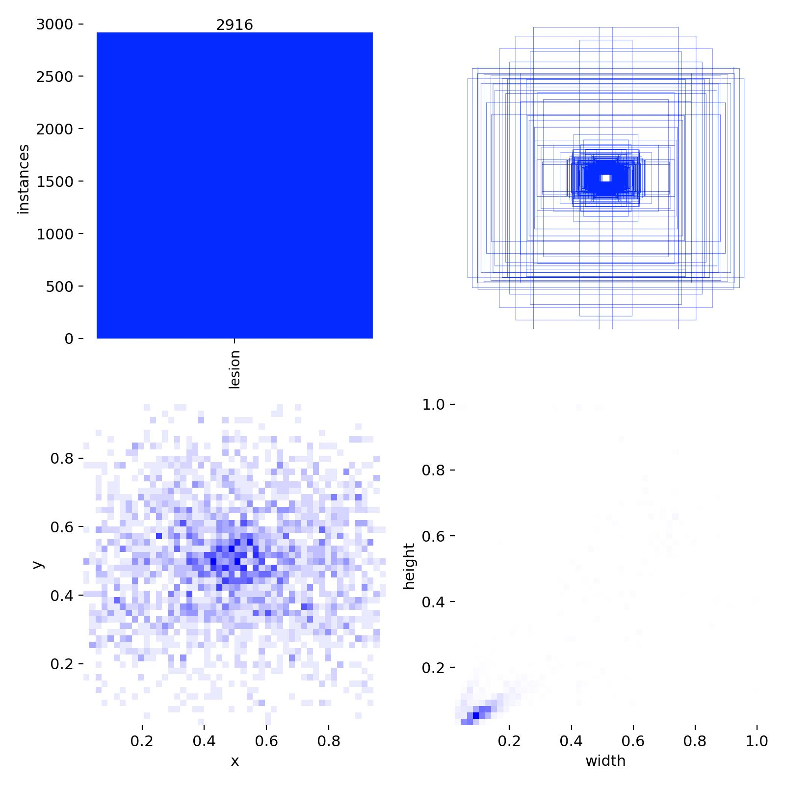

# Multi-View Breast Cancer Grading — YOLOv8 Object Detection

> Automated lesion localization on CC and MLO mammography views using YOLOv8, as part of a multi-view breast cancer grading pipeline.

---

## Overview

This module is responsible for detecting and localizing breast lesions in mammography images by predicting bounding boxes on both **Craniocaudal (CC)** and **Mediolateral Oblique (MLO)** views. Accurate bounding box prediction across both views is a critical preprocessing step for downstream multi-view breast cancer grading.

The model is trained on the **CBIS-DDSM** (Curated Breast Imaging Subset of DDSM) dataset, augmented to improve generalization across lesion types and imaging conditions.

---

## Results

### Validation Predictions
<p align="center">
  
  <br><em>YOLOv8 bounding box predictions on validation set (CC & MLO views)</em>
</p>

### Training Batch Sample
<p align="center">
  
  <br><em>Sample training batch with ground-truth bounding box annotations</em>
</p>

### Confusion Matrix
<p align="center">
  
  <br><em>Normalized confusion matrix on the validation set</em>
</p>

### Label Distribution
<p align="center">
  
  <br><em>Bounding box label distribution and spatial heatmap across the dataset</em>
</p>

---

## Repository Structure

```
├── notebooks/
│   └── object_detection.ipynb   # Full training, evaluation, and inference pipeline
├── results/
│   ├── bbox_results_all.json    # Bounding box predictions for all images
│   ├── bbox_results_yolo.json   # Raw YOLO-format prediction outputs
│   └── results.csv              # Training metrics per epoch
└── visualizations/
    ├── val_batch1_pred.jpg              # Validation predictions
    ├── train_batch1.jpg                 # Training batch samples
    ├── confusion_matrix_normalized.png  # Normalized confusion matrix
    └── labels.jpg                       # Label distribution
```

---

## Methodology

| Component | Details |
|-----------|---------|
| Model | YOLOv8 (Ultralytics) |
| Dataset | CBIS-DDSM (augmented) |
| Views | CC (Craniocaudal) + MLO (Mediolateral Oblique) |
| Task | Bounding box detection for lesion localization |
| Augmentation | Flip, rotation, mosaic, color jitter |

---

## Getting Started

### Prerequisites
```bash
pip install ultralytics opencv-python matplotlib pandas
```

### Run the Notebook
Open `notebooks/object_detection.ipynb` in Jupyter or Google Colab and follow the step-by-step pipeline:
1. Dataset preparation and augmentation
2. YOLOv8 model training on CBIS-DDSM
3. Evaluation and bounding box visualization on CC & MLO views
4. Export prediction results

---

## Project Context

This repository is part of a larger **multi-view breast cancer grading** project developed in the **Projects in Biomedical Engineering** course. The full pipeline integrates lesion detection (this module) with multi-view feature fusion and cancer grade classification.

---

## References

- [Ultralytics YOLOv8](https://github.com/ultralytics/ultralytics)
- [CBIS-DDSM Dataset](https://wiki.cancerimagingarchive.net/display/Public/CBIS-DDSM)
- Lee, R. S., et al. (2017). *A curated mammography data set for use in computer-aided detection and diagnosis research.* Scientific Data.
